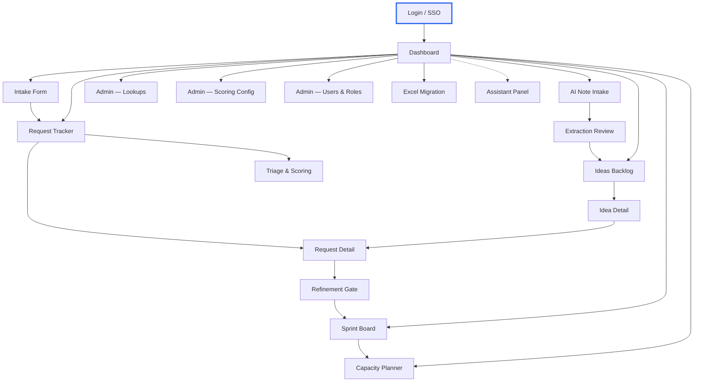
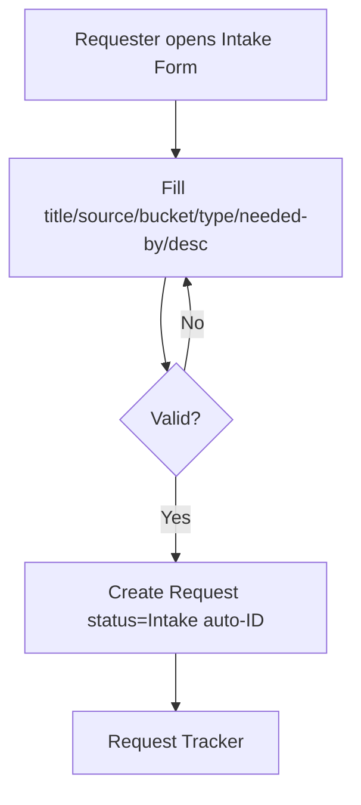
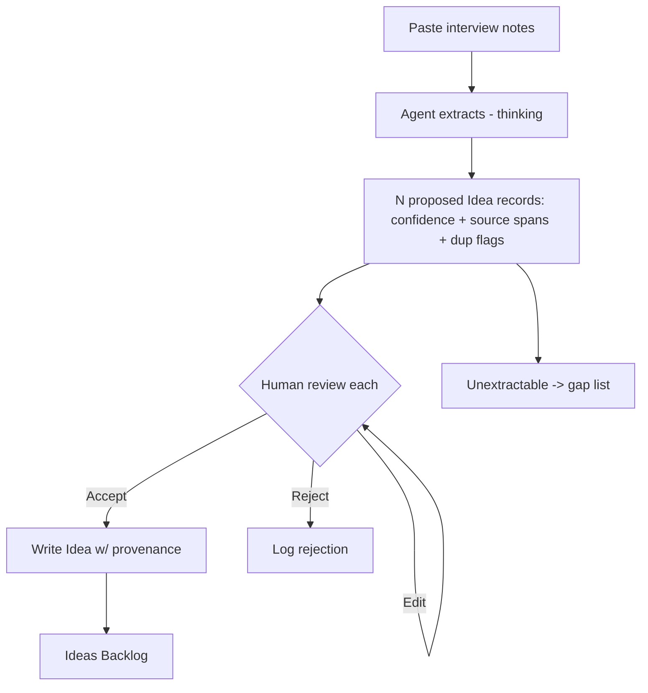
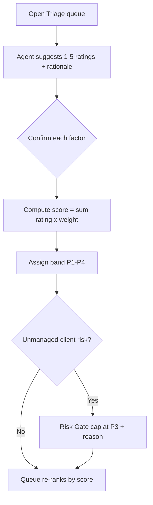
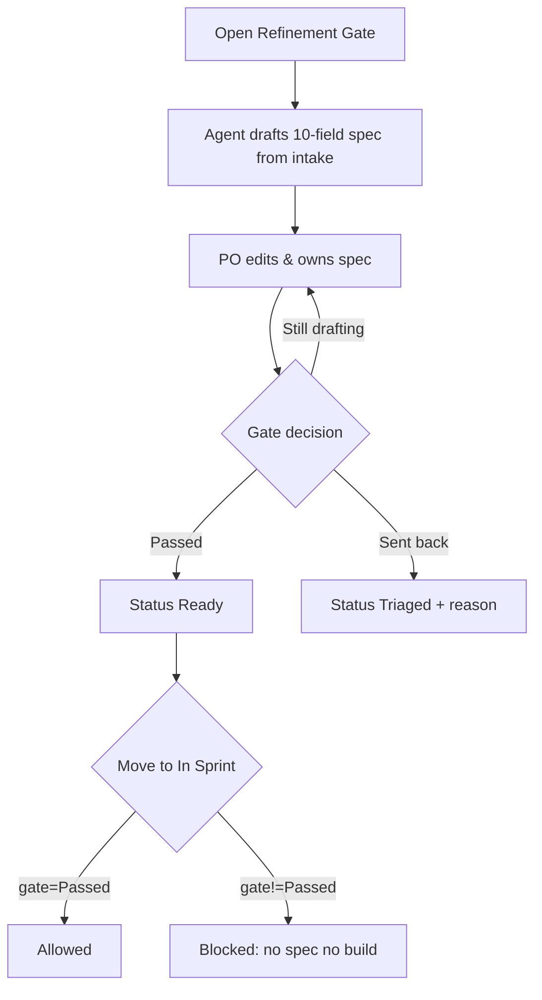
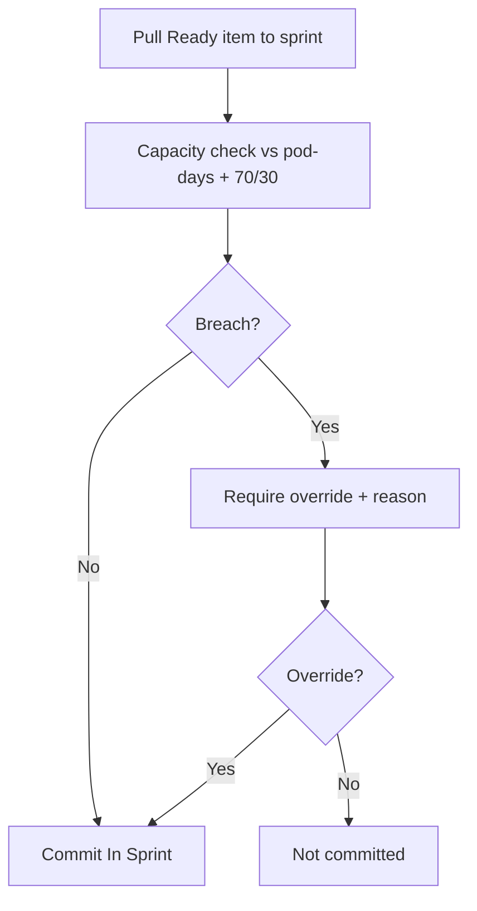
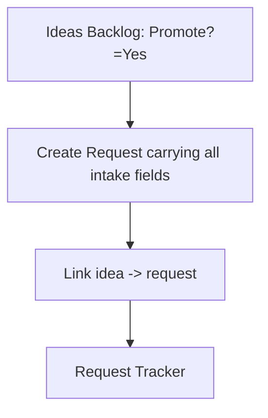

# Pod OS Web App — Phase 9 Design & Prototype Package

*Skill:* design-and-prototype v2.15 · *Mode:* pipeline · *Source:* PRD-001 (draft) · *Generated:* 2026-07-05 · *Output standard:* v1.7  
*Output path:* v0 Prompt Pack (v0 MCP offline) · *Visual direction:* data-dense · *Design system:* greenfield tokens-only

---

## Executive Summary

This package specifies **18 screens**, **6 user flows**, a complete navigation map, **20 components** (10 shared), and a behavioral bridge (state machines, data bindings, interactions, validation, component specs) that Phase 11 consumes directly. v0 MCP is offline, so each screen ships a **copy-paste-ready v0.dev prompt** below.

Five screens run the human-in-the-loop agent (AI Note Intake, Extraction Review, Triage & Scoring, Refinement Gate, Assistant Panel) — each carries the three required agentic UI states (Thinking, Low-confidence, HIL handoff). Three fields appear on multiple screens and are locked to a single source of truth: **priority score/band** (ScoreSet), **Request core fields** (Tracker), **TeamMember** (Capacity Planner).

**Seven design-time gaps** are flagged, all tracing to open PRD questions — none fabricated (auth provider, LLM policy, retention, accessibility target, agentic-detector, no SME, CC-incomplete display behaviors).

## Design System

- **Primary** `blue-600` (#2563EB) · neutrals slate-50…950 · semantic success/error/warning/info green-600/red-600/amber-500/blue-500
- **Priority bands:** P1 red-600 · P2 amber-500 · P3 blue-500 · P4 slate-500 (always with the P# text label)
- **Type:** Inter + ui-monospace for IDs/scores; scale xs–2xl; dense tables at sm (14px)
- **Spacing** 8px base, compact table cells · **Radius** md 6px default · **Elevation** low-chrome · **Motion** 150–200ms, reduced-motion honored · **Icons** lucide 16/20/24px
- **Accessibility:** WCAG AA (OQ-021 open — PO may override); contrast verified (blue-600 on white ≈ 5.2:1)

## Navigation Map



## User Flows

### Manual Intake (UF-001) — Requester



### AI Note Intake (UF-002) — PO



### Triage & Score (UF-003) — Pod Lead



### Refinement Gate (UF-004) — PO



### Sprint Commit (UF-005) — Pod Lead



### Promotion (UF-006) — PO



## Screen Inventory

| ID | Screen | Type | Persona | FRs | Rollout | Agent |
|---|---|---|---|---|---|---|
| scr_001 | Login / SSO | auth | Requester | FR-033 | P1 |  |
| scr_002 | Dashboard | dashboard | Pod Lead | FR-031 | P1 |  |
| scr_003 | Intake Form | form | Requester | FR-004 | P1 |  |
| scr_004 | AI Note Intake | agent | PO | FR-005, FR-006, FR-007 | P3 | 🤖 |
| scr_005 | Extraction Review | agent | PO | FR-005, FR-006, FR-036 | P3 | 🤖 |
| scr_006 | Ideas Backlog | list | PO | FR-008, FR-009, FR-010 | P1 |  |
| scr_007 | Idea Detail | detail | PO | FR-008, FR-009, FR-010 | P1 |  |
| scr_008 | Request Tracker | list | PodLead | FR-011, FR-012, FR-013 | P1 |  |
| scr_009 | Request Detail | detail | PO | FR-012, FR-014, FR-018 | P1 |  |
| scr_010 | Triage & Scoring | workflow | PodLead | FR-015, FR-016, FR-018, FR-019, FR-038 | P1 | 🤖 |
| scr_011 | Refinement Gate | workflow | PO | FR-020, FR-021, FR-022, FR-023 | P2 | 🤖 |
| scr_012 | Sprint Board | board | PodLead | FR-024, FR-025, FR-026 | P2 |  |
| scr_013 | Capacity Planner | workflow | PodLead | FR-027, FR-028, FR-029 | P2 |  |
| scr_014 | Admin — Lookups | admin | Admin | FR-032 | P2 |  |
| scr_015 | Admin — Scoring Config | admin | Admin | FR-017 | P1 |  |
| scr_016 | Admin — Users & Roles | admin | Admin | FR-033 | P1 |  |
| scr_017 | Excel Migration | utility | Admin | FR-034 | P1 |  |
| scr_018 | Assistant Panel | agent | PO | FR-030, FR-042 | P3 | 🤖 |

## Multi-Screen Field SSOT (Rule 17 / SI-5)

| Entity | Field | Appears on | Single source of truth |
|---|---|---|---|
| ENT-003 | priority_score / priority_band | 5 screens | Scoring engine ScoreSet (scr_010 / FR-015-016) |
| ENT-002 | Request core fields | 3 screens | Request Tracker (scr_008 / FR-012) |
| ENT-008 | TeamMember record | 2 screens | Capacity Planner (scr_013 / FR-027) |

## Pattern Library

- **PAT.001 Empty State** — lucide icon(32px) + 'No {entity} yet' headline + one-line guidance + primary CTA
- **PAT.002 Loading State** — skeleton rows for tables (pulse 1.5s); 20px spinner for actions after 300ms
- **PAT.003 Error State** — inline destructive banner scoped to the failing section + what-happened/what-to-do + retry + preserve inputs
- **PAT.004 Success Feedback** — top-right toast, auto-dismiss 5s, '{Entity} {action} successfully'; destructive actions get undo + 8s
- **PAT.005 Confirmation Dialog** — title + description + destructive action (red) + cancel; used for drop idea, override capacity, send-back
- **PAT.006 Degraded/Offline State** — banner: what is unavailable + what is still usable + expected recovery; drives nfr_008 availability (target-null → generic recovery copy)
- **PAT.007 Agent Proposal Review** — per-record card: extracted fields + confidence chip (H/M/L) + source-span quote + duplicate flag + accept/edit/reject; HIL-1/HIL-2

## Component Registry

| ID | Component | Type | Used in | Shared |
|---|---|---|---|---|
| cmp_001 | Sidebar | navigation | 10 screens | ✓ |
| cmp_002 | PageHeader | layout | 18 screens | ✓ |
| cmp_003 | DataTable | data-display | 5 screens | ✓ |
| cmp_004 | PriorityBadge | data-display | 5 screens | ✓ |
| cmp_005 | StatusBadge | data-display | 5 screens | ✓ |
| cmp_006 | AgentThinkingIndicator | feedback | 3 screens | ✓ |
| cmp_007 | AgentLowConfidenceBanner | feedback | 2 screens | ✓ |
| cmp_008 | AgentHILHandoffPanel | overlay | 3 screens | ✓ |
| cmp_009 | ConfidenceChip | data-display | 1 screens |  |
| cmp_010 | AuditTrail | data-display | 2 screens | ✓ |
| cmp_011 | ScoreEditor | form | 1 screens |  |
| cmp_012 | CapacityGrid | data-display | 1 screens |  |
| cmp_013 | CapacityGauge | data-display | 1 screens |  |
| cmp_014 | KanbanBoard | layout | 1 screens |  |
| cmp_015 | ProposalCard | overlay | 1 screens |  |
| cmp_016 | LookupSelect | form | 2 screens | ✓ |
| cmp_017 | RiskGateNotice | feedback | 2 screens |  |
| cmp_018 | OverrideDialog | overlay | 1 screens |  |
| cmp_019 | AssistantPanel | overlay | 1 screens |  |
| cmp_020 | LastUpdatedLabel | data-display | 1 screens |  |

## Screen Specifications

### Login / SSO (scr_001)

*Type:* auth · *Persona:* Requester · *Roles:* * · *FRs:* FR-033 · *Rollout:* P1

**Layout.** Centered card on slate-50: product wordmark, single 'Sign in with SSO' button, provider-pending note. No password fields (SSO only).

**Components.** AuthCard, Button

**Actions.** Sign in via SSO

**NFR bindings.** nfr_005 (sec) → Generic 'Sign in with SSO' — provider unconfirmed (OQ-003); no provider logo assumed

**States.** normal: SSO button, loading: PAT.002, error: PAT.003 (auth failed)

### Dashboard (scr_002)

*Type:* dashboard · *Persona:* Pod Lead · *Roles:* PodLead, PO, Engineer, Viewer, Admin · *FRs:* FR-031 · *Rollout:* P1

**Layout.** Left sidebar nav + main: KPI card grid (top), open-queue by band (mid), overdue + blocked lists (bottom). Each computed KPI shows a 'last updated' timestamp.

**Components.** Sidebar, PageHeader, KpiCard, PriorityBadge, DataTable, LastUpdatedLabel

**Actions.** Filter by bucket; Drill into a KPI list; Open a request

**SSOT (read by reference, no local copy).** priority_score / priority_band ← Scoring engine ScoreSet (scr_010); Request core fields (title/status/owner/needed_by) ← Request Tracker (scr_008)

**NFR bindings.** nfr_013 (obs) → 'last updated' label on every computed KPI (KPIs are computed, not manually refreshed — FR-002/FR-031); nfr_008 (avail) → PAT.006 degraded banner when the data service is unreachable

**States.** normal: KPI grid, empty: PAT.001 (no data — pre-migration), loading: PAT.002, error: PAT.003, degraded: PAT.006

### Intake Form (scr_003)

*Type:* form · *Persona:* Requester · *Roles:* Requester, PO, PodLead, Admin · *FRs:* FR-004 · *Rollout:* P1

**Layout.** Single-column form card: title, source(lookup), bucket(Client/Internal), type(lookup), date-in(auto,readonly), needed-by(date), references(URL list), description(textarea). Submit + Cancel.

**Components.** PageHeader, FormField, LookupSelect, DatePicker, UrlListInput, Button

**Actions.** Submit request (creates Request status=Intake, auto-ID); Cancel

**NFR bindings.** nfr_006 (perf) → optimistic submit + toast; record available immediately

**States.** normal: form, loading: PAT.002, error: PAT.003 (validation summary), success: PAT.004

### AI Note Intake (scr_004)  🤖 agent-active

*Type:* agent · *Persona:* PO · *Roles:* PO, PodLead, Admin · *FRs:* FR-005, FR-006, FR-007 · *Rollout:* P3

**Layout.** Two-pane: left = large paste/upload textarea + 'Extract' button; right = live agent progress then proposed record count. Agent thinking state during extraction.

**Components.** PageHeader, NoteInput, Button, AgentThinkingIndicator, ExtractionSummary

**Actions.** Paste/upload notes; Run extraction (agent proposes N idea records — never writes); Go to review

**NFR bindings.** nfr_012 (data) → pre-extraction notice: LLM provider + client-data policy pending (OQ-007) — shown before first send; nfr_009 (ux) → English-only V1 note on the input

**States.** normal: paste pane, thinking: AgentThinkingIndicator, empty: PAT.001 (paste notes to begin), error: PAT.003 (extraction failed)

### Extraction Review (scr_005)  🤖 agent-active

*Type:* agent · *Persona:* PO · *Roles:* PO, PodLead, Admin · *FRs:* FR-005, FR-006, FR-036 · *Rollout:* P3

**Layout.** Stack of proposal cards (PAT.007): each shows extracted A–F fields, per-field confidence chip, quoted source span, duplicate-match flag. Per card: Accept / Edit / Reject. Bulk confirm bar. Unextractable fields listed as a gap list.

**Components.** ProposalCard, ConfidenceChip, SourceSpanQuote, DuplicateFlag, AgentLowConfidenceBanner, AgentHILHandoffPanel, GapList, Button

**Actions.** Accept record (writes Idea); Edit field; Reject record (logged); View gap list

**NFR bindings.** nfr_009 (ux) → confidence chips + source quotes make extraction trust legible

**States.** normal: proposal cards, low_confidence: AgentLowConfidenceBanner, hil_handoff: AgentHILHandoffPanel, empty: PAT.001 (no proposals), error: PAT.003

### Ideas Backlog (scr_006)

*Type:* list · *Persona:* PO · *Roles:* PO, PodLead, Admin · *FRs:* FR-008, FR-009, FR-010 · *Rollout:* P1

**Layout.** Toolbar (filter/sort/search) + DataTable of ideas: I-###, idea/problem, raised-by, source, type, rough value/effort, confidence, disposition, promote?. Row click → detail.

**Components.** PageHeader, FilterBar, DataTable, StatusBadge, Button

**Actions.** Filter/sort; Open idea; Promote to request; Drop idea (reason required — PAT.005)

**States.** normal: table, empty: PAT.001 (no ideas), loading: PAT.002, error: PAT.003

### Idea Detail (scr_007)

*Type:* detail · *Persona:* PO · *Roles:* PO, PodLead, Admin · *FRs:* FR-008, FR-009, FR-010 · *Rollout:* P1

**Layout.** Two-column: left = full A–F Intake Record fields (editable), right = disposition selector + promote button + provenance (source note, extraction log) + audit trail.

**Components.** PageHeader, FormField, DispositionSelect, AuditTrail, Button

**Actions.** Edit fields; Set disposition; Promote to request (creates Request, carries fields, links); Drop (reason)

**States.** normal: detail, loading: PAT.002, error: PAT.003, success: PAT.004

### Request Tracker (scr_008)

*Type:* list · *Persona:* PodLead · *Roles:* PodLead, PO, Engineer, Viewer, Admin · *FRs:* FR-011, FR-012, FR-013 · *Rollout:* P1

**Layout.** Master DataTable: R-###, title, source, bucket, type, date-in, needed-by, references, status, stage-gate, owner, priority score, band. Overdue rows flagged (red dot + text). Sort by score.

**Components.** PageHeader, FilterBar, DataTable, PriorityBadge, StatusBadge, OverdueFlag

**Actions.** Filter/sort by any column; Open request; Sort by priority score

**SSOT (read by reference, no local copy).** priority_score / priority_band ← Scoring engine ScoreSet (scr_010)

**NFR bindings.** nfr_001 (scale) → virtualized/paginated table for hundreds–thousands of rows; nfr_002 (scale) → server-side sort/filter to sustain year-1 volume

**States.** normal: table, empty: PAT.001, loading: PAT.002, error: PAT.003

### Request Detail (scr_009)

*Type:* detail · *Persona:* PO · *Roles:* PO, PodLead, Engineer, Admin · *FRs:* FR-012, FR-014, FR-018 · *Rollout:* P1

**Layout.** Header (R-###, title, status, priority badge + band, Risk-Gate cap notice if capped). Tabs: Details | Score | Gate | Audit trail. Score tab shows computed score read-only (SSOT). Audit tab lists every field change (user/time/old→new/path).

**Components.** PageHeader, PriorityBadge, RiskGateNotice, Tabs, AuditTrail, StatusBadge

**Actions.** Edit editable fields; View score (read-only); View audit trail; Advance status (lifecycle-constrained)

**SSOT (read by reference, no local copy).** priority_score / priority_band ← Scoring engine ScoreSet (scr_010); Request core fields (title/status/owner/needed_by) ← Request Tracker (scr_008)

**NFR bindings.** nfr_004 (sec) → Audit tab renders immutable who/what/when/old→new/path (FR-014); nfr_011 (data) → note-retention policy pending (OQ-008) surfaced on records holding client-named data

**States.** normal: detail, loading: PAT.002, error: PAT.003, success: PAT.004

### Triage & Scoring (scr_010)  🤖 agent-active

*Type:* workflow · *Persona:* PodLead · *Roles:* PodLead, PO, Admin · *FRs:* FR-015, FR-016, FR-018, FR-019, FR-038 · *Rollout:* P1

**Layout.** Ranked queue (left) + scoring panel (right). Scoring panel: 4 factor sliders (1–5) with agent-suggested value + one-line rationale (confirm each), live computed score + band, Risk-Gate toggle. Queue re-ranks on confirm.

**Components.** PageHeader, RankedQueue, ScoreEditor, FactorSlider, PriorityBadge, AgentLowConfidenceBanner, RiskGateToggle

**Actions.** Confirm/adjust factor rating (agent proposes); Apply Risk-Gate cap; Set disposition; Re-rank queue

**SSOT (read by reference, no local copy).** priority_score / priority_band ← Scoring engine ScoreSet (scr_010)

**NFR bindings.** nfr_010 (ux) → factor sliders + live score keep triage <3 interactions per request

**States.** normal: queue+panel, low_confidence: AgentLowConfidenceBanner (agent score suggestion), loading: PAT.002, error: PAT.003, success: PAT.004

### Refinement Gate (scr_011)  🤖 agent-active

*Type:* workflow · *Persona:* PO · *Roles:* PO, PodLead, Admin · *FRs:* FR-020, FR-021, FR-022, FR-023 · *Rollout:* P2

**Layout.** Split: left = 10-field spec form (agent-draft button pre-fills from intake, PO edits/owns), right = gate decision panel (Still drafting / Passed / Sent back+reason). 'No spec, no build' hard-block indicator on status.

**Components.** PageHeader, GateSpecForm, AgentThinkingIndicator, AgentHILHandoffPanel, GateDecisionPanel, Button

**Actions.** Draft spec from intake (agent proposes); Edit spec; Set gate decision; Send back with reason (PAT.005)

**NFR bindings.** nfr_009 (ux) → English-only agent draft V1

**States.** normal: spec+decision, thinking: AgentThinkingIndicator (drafting), hil_handoff: AgentHILHandoffPanel (PO owns draft), loading: PAT.002, error: PAT.003, success: PAT.004

### Sprint Board (scr_012)

*Type:* board · *Persona:* PodLead · *Roles:* PodLead, Engineer, PO, Viewer, Admin · *FRs:* FR-024, FR-025, FR-026 · *Rollout:* P2

**Layout.** Kanban columns by status (committed → in progress → in review → done + blocked). Header: sprint name/dates, capacity gauge (client vs internal pod-days, 70/30). Commit drawer runs capacity check; breach requires override+reason.

**Components.** PageHeader, KanbanBoard, SprintCard, CapacityGauge, OverrideDialog, StatusBadge, PriorityBadge

**Actions.** Commit item (capacity check); Override breach (reason, PAT.005); Update status/%/blocker (own items; Pod Lead all); Add mid-sprint (override)

**SSOT (read by reference, no local copy).** priority_score / priority_band ← Scoring engine ScoreSet (scr_010); Request core fields (title/status/owner/needed_by) ← Request Tracker (scr_008); TeamMember (name/role/availability) ← Capacity Planner (scr_013)

**States.** normal: kanban, empty: PAT.001 (no committed items), loading: PAT.002, error: PAT.003, success: PAT.004

### Capacity Planner (scr_013)

*Type:* workflow · *Persona:* PodLead · *Roles:* PodLead, Admin · *FRs:* FR-027, FR-028, FR-029 · *Rollout:* P2

**Layout.** Roster table (member, role, R&R, level, active) + per-sprint availability grid (numeric 0–1 inputs, VR-001 validated). Live totals: total pod-days, client_days (×0.70), internal_days (×0.30). Editing availability re-flags no-longer-fitting sprints.

**Components.** PageHeader, RosterTable, CapacityGrid, AvailabilityInput, PodDaysTotals, Button

**Actions.** Add/deactivate member (never delete); Edit availability (0–1); Recompute pod-days/70-30; Flag broken commitments

**SSOT (read by reference, no local copy).** TeamMember (name/role/availability) ← Capacity Planner (scr_013)

**NFR bindings.** nfr_001 (scale) → grid supports ~15 concurrent editors; optimistic + last-confirmed-wins per FR-041

**States.** normal: roster+grid, empty: PAT.001 (no members), loading: PAT.002, error: PAT.003 (VR-001 non-numeric rejected), success: PAT.004

### Admin — Lookups (scr_014)

*Type:* admin · *Persona:* Admin · *Roles:* Admin · *FRs:* FR-032 · *Rollout:* P2

**Layout.** Tabbed list manager for the 9 lookup lists (Source, Type, Status, Stage Gate, Owner, Rating, Sprint, Bucket, RAG). Add/rename/deactivate values.

**Components.** PageHeader, Tabs, DataTable, Button

**Actions.** Add value; Rename; Deactivate

**States.** normal: tabs+table, empty: PAT.001, loading: PAT.002, error: PAT.003

### Admin — Scoring Config (scr_015)

*Type:* admin · *Persona:* Admin · *Roles:* Admin · *FRs:* FR-017 · *Rollout:* P1

**Layout.** Weights editor (factor name + weight, max-score derived) + band thresholds editor (P1–P4) + version history list. Save creates a new version; scores recompute.

**Components.** PageHeader, WeightsEditor, BandThresholdEditor, VersionHistory, Button

**Actions.** Edit weights (admin only); Edit band thresholds; Save new version (recomputes scores); View version history

**NFR bindings.** nfr_003 (sec) → admin-only guard; non-admin cannot open (FR-017/BR-010)

**States.** normal: editors, loading: PAT.002, error: PAT.003 (VR-008 split sum≠1), success: PAT.004

### Admin — Users & Roles (scr_016)

*Type:* admin · *Persona:* Admin · *Roles:* Admin · *FRs:* FR-033 · *Rollout:* P1

**Layout.** User table (name, email, role, active) with role selector (Admin, Pod Lead, PO/BA, Engineer, Requester, Viewer). Requester-access decision pending (OQ-006) noted.

**Components.** PageHeader, DataTable, RoleSelect, Button

**Actions.** Assign role; Deactivate user; Invite user

**NFR bindings.** nfr_003 (sec) → 6 least-privilege roles; Requester scope 'view own' (OQ-006 pending)

**States.** normal: table, loading: PAT.002, error: PAT.003, success: PAT.004

### Excel Migration (scr_017)

*Type:* utility · *Persona:* Admin · *Roles:* Admin · *FRs:* FR-034 · *Rollout:* P1

**Layout.** Upload workbook → mapping preview → cleanup report table (rows needing decisions: broken formulas, free-text availability, ID collisions R-001/R-003/R-006). Per-row accept/fix/skip. Run import.

**Components.** PageHeader, FileUpload, MappingPreview, CleanupReportTable, Button

**Actions.** Upload workbook; Review mapping; Resolve cleanup rows (per-row decision); Run one-time import

**NFR bindings.** nfr_011 (data) → migrated notes carry client names — retention/read-access pending (OQ-008) flagged in report

**States.** normal: upload+report, empty: PAT.001 (no file), loading: PAT.002 (importing), error: PAT.003

### Assistant Panel (scr_018)  🤖 agent-active

*Type:* agent · *Persona:* PO · *Roles:* PodLead, PO, Engineer, Admin · *FRs:* FR-030, FR-042 · *Rollout:* P3

**Layout.** Docked right-side chat panel available app-wide. Natural-language field edits ('add Omar at 50% for Sprint 3') → agent shows computed impact preview → human confirms before write. Weekly digest command. Inherits chatting user's permissions.

**Components.** AssistantPanel, ChatInput, ImpactPreview, AgentThinkingIndicator, AgentHILHandoffPanel, Button

**Actions.** Chat edit any editable field (propose→impact→confirm); Request weekly digest; Confirm/cancel proposed write

**NFR bindings.** nfr_010 (ux) → impact preview before write keeps chat edits safe/legible

**States.** normal: chat, thinking: AgentThinkingIndicator, hil_handoff: AgentHILHandoffPanel (confirm before write), empty: PAT.001 (ask me to edit or summarize), error: PAT.003

---

## v0 Prompts — Copy & Paste Ready

v0 MCP is offline. Paste any prompt below directly into v0.dev. Prompts carry an explicit modern-SaaS design direction.

### Login / SSO (scr_001)

```text
Build a auth screen called "Login / SSO" for Pod OS — an internal Integrant product-ops app replacing an Excel workbook.

PERSONA: Requester — internal Integrant staff running the Agentic Pod's intake / triage / sprint operation.
PURPOSE: Centered card on slate-50: product wordmark, single 'Sign in with SSO' button, provider-pending note. No password fields (SSO only).

COMPONENTS NEEDED:
  - AuthCard
  - Button

DATA DISPLAYED (field names must match exactly):
  - User identity (post-auth)

ACTIONS (do not add any beyond these):
  - Sign in via SSO

STATES:
  - normal: SSO button
  - loading: PAT.002
  - error: PAT.003 (auth failed)

ACCESS: roles ['*']

TECH STACK: React (Next.js App Router), Tailwind CSS, shadcn/ui, lucide-react.

DESIGN DIRECTION — clean, modern, premium (Linear / Vercel / Height tier):
  - Feel: minimal, calm, content-first, generous whitespace, low chrome. A 2026 productivity SaaS — NOT a 2015 enterprise dashboard.
  - Navigation: LIGHT sidebar (white / near-white) with a hairline border, muted icon+label, subtle tinted active state. No dark heavy sidebar, no saturated fills.
  - Typography: Geist or Inter; tight heading tracking (-0.02em); tabular-nums for ALL numbers/IDs/scores; muted secondary text (zinc-400/500); clear hierarchy; never cramped.
  - Color: neutral zinc base on an off-white app bg (#FAFAFB); ONE restrained accent (indigo-600) for primary actions, active nav, focus rings only. Everything else neutral.
  - Status & priority: SOFT TINTED pills — bg-{c}-50 + text-{c}-700 + subtle ring — never solid saturated fills. Priority bands P1 rose / P2 amber / P3 sky / P4 zinc, always with the P# text label.
  - Surfaces: white cards, hairline zinc-200 borders, large radius (rounded-xl), soft shadow-sm; buttons/inputs rounded-lg.
  - Motion: subtle 150–200ms ease; respect prefers-reduced-motion. Icons: lucide, 2px stroke, 16–20px.
  - Refined details, no visual noise. Err toward more space, lighter weight, and fewer borders.

ACCESSIBILITY (WCAG AA): ≥44px targets; focus-visible ring on every focusable element; prefers-reduced-motion honored; color never the sole indicator (pair with text/icon); semantic landmarks; form errors via aria-describedby.

MICROCOPY: buttons verb+noun; errors say what happened + how to fix; empty states say what will appear + how to start. English only (V1).

CONSTRAINTS: no navigation/features beyond those listed; do not invent an auth provider, latency numbers, or a logo. Auth is Microsoft 365 SSO. Intake agent uses an enterprise LLM under a DPA (no training); notes retained 12 months.
```

### Dashboard (scr_002)

```text
Build a dashboard screen called "Dashboard" for Pod OS — an internal Integrant product-ops app replacing an Excel workbook.

PERSONA: Pod Lead — internal Integrant staff running the Agentic Pod's intake / triage / sprint operation.
PURPOSE: Left sidebar nav + main: KPI card grid (top), open-queue by band (mid), overdue + blocked lists (bottom). Each computed KPI shows a 'last updated' timestamp.

COMPONENTS NEEDED:
  - Sidebar
  - PageHeader
  - KpiCard
  - PriorityBadge
  - DataTable
  - LastUpdatedLabel

DATA DISPLAYED (field names must match exactly):
  - Total requests, In sprint, Ready, In refinement, Done, Overdue&not-done, P1/P2 open, client vs internal open, % mix, avg score

ACTIONS (do not add any beyond these):
  - Filter by bucket
  - Drill into a KPI list
  - Open a request

STATES:
  - normal: KPI grid
  - empty: PAT.001 (no data — pre-migration)
  - loading: PAT.002
  - error: PAT.003
  - degraded: PAT.006

SINGLE-SOURCE-OF-TRUTH (read by reference — do NOT recompute or store a local copy):
  - priority_score / priority_band ← Scoring engine ScoreSet (scr_010)
  - Request core fields (title/status/owner/needed_by) ← Request Tracker (scr_008)
ACCESS: roles ['PodLead', 'PO', 'Engineer', 'Viewer', 'Admin']

TECH STACK: React (Next.js App Router), Tailwind CSS, shadcn/ui, lucide-react.

DESIGN DIRECTION — clean, modern, premium (Linear / Vercel / Height tier):
  - Feel: minimal, calm, content-first, generous whitespace, low chrome. A 2026 productivity SaaS — NOT a 2015 enterprise dashboard.
  - Navigation: LIGHT sidebar (white / near-white) with a hairline border, muted icon+label, subtle tinted active state. No dark heavy sidebar, no saturated fills.
  - Typography: Geist or Inter; tight heading tracking (-0.02em); tabular-nums for ALL numbers/IDs/scores; muted secondary text (zinc-400/500); clear hierarchy; never cramped.
  - Color: neutral zinc base on an off-white app bg (#FAFAFB); ONE restrained accent (indigo-600) for primary actions, active nav, focus rings only. Everything else neutral.
  - Status & priority: SOFT TINTED pills — bg-{c}-50 + text-{c}-700 + subtle ring — never solid saturated fills. Priority bands P1 rose / P2 amber / P3 sky / P4 zinc, always with the P# text label.
  - Surfaces: white cards, hairline zinc-200 borders, large radius (rounded-xl), soft shadow-sm; buttons/inputs rounded-lg.
  - Motion: subtle 150–200ms ease; respect prefers-reduced-motion. Icons: lucide, 2px stroke, 16–20px.
  - Refined details, no visual noise. Err toward more space, lighter weight, and fewer borders.

ACCESSIBILITY (WCAG AA): ≥44px targets; focus-visible ring on every focusable element; prefers-reduced-motion honored; color never the sole indicator (pair with text/icon); semantic landmarks; form errors via aria-describedby.

MICROCOPY: buttons verb+noun; errors say what happened + how to fix; empty states say what will appear + how to start. English only (V1).

CONSTRAINTS: no navigation/features beyond those listed; do not invent an auth provider, latency numbers, or a logo. Auth is Microsoft 365 SSO. Intake agent uses an enterprise LLM under a DPA (no training); notes retained 12 months.
```

### Intake Form (scr_003)

```text
Build a form screen called "Intake Form" for Pod OS — an internal Integrant product-ops app replacing an Excel workbook.

PERSONA: Requester — internal Integrant staff running the Agentic Pod's intake / triage / sprint operation.
PURPOSE: Single-column form card: title, source(lookup), bucket(Client/Internal), type(lookup), date-in(auto,readonly), needed-by(date), references(URL list), description(textarea). Submit + Cancel.

COMPONENTS NEEDED:
  - PageHeader
  - FormField
  - LookupSelect
  - DatePicker
  - UrlListInput
  - Button

DATA DISPLAYED (field names must match exactly):
  - Request: title, source, bucket, type, date_in, needed_by, references, description

ACTIONS (do not add any beyond these):
  - Submit request (creates Request status=Intake, auto-ID)
  - Cancel

STATES:
  - normal: form
  - loading: PAT.002
  - error: PAT.003 (validation summary)
  - success: PAT.004

ACCESS: roles ['Requester', 'PO', 'PodLead', 'Admin']

TECH STACK: React (Next.js App Router), Tailwind CSS, shadcn/ui, lucide-react.

DESIGN DIRECTION — clean, modern, premium (Linear / Vercel / Height tier):
  - Feel: minimal, calm, content-first, generous whitespace, low chrome. A 2026 productivity SaaS — NOT a 2015 enterprise dashboard.
  - Navigation: LIGHT sidebar (white / near-white) with a hairline border, muted icon+label, subtle tinted active state. No dark heavy sidebar, no saturated fills.
  - Typography: Geist or Inter; tight heading tracking (-0.02em); tabular-nums for ALL numbers/IDs/scores; muted secondary text (zinc-400/500); clear hierarchy; never cramped.
  - Color: neutral zinc base on an off-white app bg (#FAFAFB); ONE restrained accent (indigo-600) for primary actions, active nav, focus rings only. Everything else neutral.
  - Status & priority: SOFT TINTED pills — bg-{c}-50 + text-{c}-700 + subtle ring — never solid saturated fills. Priority bands P1 rose / P2 amber / P3 sky / P4 zinc, always with the P# text label.
  - Surfaces: white cards, hairline zinc-200 borders, large radius (rounded-xl), soft shadow-sm; buttons/inputs rounded-lg.
  - Motion: subtle 150–200ms ease; respect prefers-reduced-motion. Icons: lucide, 2px stroke, 16–20px.
  - Refined details, no visual noise. Err toward more space, lighter weight, and fewer borders.

ACCESSIBILITY (WCAG AA): ≥44px targets; focus-visible ring on every focusable element; prefers-reduced-motion honored; color never the sole indicator (pair with text/icon); semantic landmarks; form errors via aria-describedby.

MICROCOPY: buttons verb+noun; errors say what happened + how to fix; empty states say what will appear + how to start. English only (V1).

CONSTRAINTS: no navigation/features beyond those listed; do not invent an auth provider, latency numbers, or a logo. Auth is Microsoft 365 SSO. Intake agent uses an enterprise LLM under a DPA (no training); notes retained 12 months.
```

### AI Note Intake (scr_004)

```text
Build a agent screen called "AI Note Intake" for Pod OS — an internal Integrant product-ops app replacing an Excel workbook.

PERSONA: PO — internal Integrant staff running the Agentic Pod's intake / triage / sprint operation.
PURPOSE: Two-pane: left = large paste/upload textarea + 'Extract' button; right = live agent progress then proposed record count. Agent thinking state during extraction.

COMPONENTS NEEDED:
  - PageHeader
  - NoteInput
  - Button
  - AgentThinkingIndicator
  - ExtractionSummary

DATA DISPLAYED (field names must match exactly):
  - IntakeNote: raw_text
  - ExtractionProposal: count, per-field confidence, source spans

ACTIONS (do not add any beyond these):
  - Paste/upload notes
  - Run extraction (agent proposes N idea records — never writes)
  - Go to review

STATES:
  - normal: paste pane
  - thinking: AgentThinkingIndicator
  - empty: PAT.001 (paste notes to begin)
  - error: PAT.003 (extraction failed)

AGENTIC UI STATES (this screen runs the human-in-the-loop agent — all writes human-confirmed):
  - Thinking: subtle animated indicator + current step + Cancel; respects prefers-reduced-motion
  - Low-confidence: draft + confidence chip (H/M/L) + 'verify with human' + source-span citation (HIL-2)
  - HIL handoff: why it triggered + editable draft + accept/reject/edit + audit capture (HIL-1)

ACCESS: roles ['PO', 'PodLead', 'Admin']

TECH STACK: React (Next.js App Router), Tailwind CSS, shadcn/ui, lucide-react.

DESIGN DIRECTION — clean, modern, premium (Linear / Vercel / Height tier):
  - Feel: minimal, calm, content-first, generous whitespace, low chrome. A 2026 productivity SaaS — NOT a 2015 enterprise dashboard.
  - Navigation: LIGHT sidebar (white / near-white) with a hairline border, muted icon+label, subtle tinted active state. No dark heavy sidebar, no saturated fills.
  - Typography: Geist or Inter; tight heading tracking (-0.02em); tabular-nums for ALL numbers/IDs/scores; muted secondary text (zinc-400/500); clear hierarchy; never cramped.
  - Color: neutral zinc base on an off-white app bg (#FAFAFB); ONE restrained accent (indigo-600) for primary actions, active nav, focus rings only. Everything else neutral.
  - Status & priority: SOFT TINTED pills — bg-{c}-50 + text-{c}-700 + subtle ring — never solid saturated fills. Priority bands P1 rose / P2 amber / P3 sky / P4 zinc, always with the P# text label.
  - Surfaces: white cards, hairline zinc-200 borders, large radius (rounded-xl), soft shadow-sm; buttons/inputs rounded-lg.
  - Motion: subtle 150–200ms ease; respect prefers-reduced-motion. Icons: lucide, 2px stroke, 16–20px.
  - Refined details, no visual noise. Err toward more space, lighter weight, and fewer borders.

ACCESSIBILITY (WCAG AA): ≥44px targets; focus-visible ring on every focusable element; prefers-reduced-motion honored; color never the sole indicator (pair with text/icon); semantic landmarks; form errors via aria-describedby.

MICROCOPY: buttons verb+noun; errors say what happened + how to fix; empty states say what will appear + how to start. English only (V1).

CONSTRAINTS: no navigation/features beyond those listed; do not invent an auth provider, latency numbers, or a logo. Auth is Microsoft 365 SSO. Intake agent uses an enterprise LLM under a DPA (no training); notes retained 12 months.
```

### Extraction Review (scr_005)

```text
Build a agent screen called "Extraction Review" for Pod OS — an internal Integrant product-ops app replacing an Excel workbook.

PERSONA: PO — internal Integrant staff running the Agentic Pod's intake / triage / sprint operation.
PURPOSE: Stack of proposal cards (PAT.007): each shows extracted A–F fields, per-field confidence chip, quoted source span, duplicate-match flag. Per card: Accept / Edit / Reject. Bulk confirm bar. Unextractable fields listed as a gap list.

COMPONENTS NEEDED:
  - ProposalCard
  - ConfidenceChip
  - SourceSpanQuote
  - DuplicateFlag
  - AgentLowConfidenceBanner
  - AgentHILHandoffPanel
  - GapList
  - Button

DATA DISPLAYED (field names must match exactly):
  - ExtractionProposal fields, confidence, source_spans, duplicate_flag; Idea (on confirm)

ACTIONS (do not add any beyond these):
  - Accept record (writes Idea)
  - Edit field
  - Reject record (logged)
  - View gap list

STATES:
  - normal: proposal cards
  - low_confidence: AgentLowConfidenceBanner
  - hil_handoff: AgentHILHandoffPanel
  - empty: PAT.001 (no proposals)
  - error: PAT.003

AGENTIC UI STATES (this screen runs the human-in-the-loop agent — all writes human-confirmed):
  - Thinking: subtle animated indicator + current step + Cancel; respects prefers-reduced-motion
  - Low-confidence: draft + confidence chip (H/M/L) + 'verify with human' + source-span citation (HIL-2)
  - HIL handoff: why it triggered + editable draft + accept/reject/edit + audit capture (HIL-1)

ACCESS: roles ['PO', 'PodLead', 'Admin']

TECH STACK: React (Next.js App Router), Tailwind CSS, shadcn/ui, lucide-react.

DESIGN DIRECTION — clean, modern, premium (Linear / Vercel / Height tier):
  - Feel: minimal, calm, content-first, generous whitespace, low chrome. A 2026 productivity SaaS — NOT a 2015 enterprise dashboard.
  - Navigation: LIGHT sidebar (white / near-white) with a hairline border, muted icon+label, subtle tinted active state. No dark heavy sidebar, no saturated fills.
  - Typography: Geist or Inter; tight heading tracking (-0.02em); tabular-nums for ALL numbers/IDs/scores; muted secondary text (zinc-400/500); clear hierarchy; never cramped.
  - Color: neutral zinc base on an off-white app bg (#FAFAFB); ONE restrained accent (indigo-600) for primary actions, active nav, focus rings only. Everything else neutral.
  - Status & priority: SOFT TINTED pills — bg-{c}-50 + text-{c}-700 + subtle ring — never solid saturated fills. Priority bands P1 rose / P2 amber / P3 sky / P4 zinc, always with the P# text label.
  - Surfaces: white cards, hairline zinc-200 borders, large radius (rounded-xl), soft shadow-sm; buttons/inputs rounded-lg.
  - Motion: subtle 150–200ms ease; respect prefers-reduced-motion. Icons: lucide, 2px stroke, 16–20px.
  - Refined details, no visual noise. Err toward more space, lighter weight, and fewer borders.

ACCESSIBILITY (WCAG AA): ≥44px targets; focus-visible ring on every focusable element; prefers-reduced-motion honored; color never the sole indicator (pair with text/icon); semantic landmarks; form errors via aria-describedby.

MICROCOPY: buttons verb+noun; errors say what happened + how to fix; empty states say what will appear + how to start. English only (V1).

CONSTRAINTS: no navigation/features beyond those listed; do not invent an auth provider, latency numbers, or a logo. Auth is Microsoft 365 SSO. Intake agent uses an enterprise LLM under a DPA (no training); notes retained 12 months.
```

### Ideas Backlog (scr_006)

```text
Build a list screen called "Ideas Backlog" for Pod OS — an internal Integrant product-ops app replacing an Excel workbook.

PERSONA: PO — internal Integrant staff running the Agentic Pod's intake / triage / sprint operation.
PURPOSE: Toolbar (filter/sort/search) + DataTable of ideas: I-###, idea/problem, raised-by, source, type, rough value/effort, confidence, disposition, promote?. Row click → detail.

COMPONENTS NEEDED:
  - PageHeader
  - FilterBar
  - DataTable
  - StatusBadge
  - Button

DATA DISPLAYED (field names must match exactly):
  - Idea: id, problem, raised_by, source, type, rough_value, rough_effort, confidence, disposition, promote

ACTIONS (do not add any beyond these):
  - Filter/sort
  - Open idea
  - Promote to request
  - Drop idea (reason required — PAT.005)

STATES:
  - normal: table
  - empty: PAT.001 (no ideas)
  - loading: PAT.002
  - error: PAT.003

ACCESS: roles ['PO', 'PodLead', 'Admin']

TECH STACK: React (Next.js App Router), Tailwind CSS, shadcn/ui, lucide-react.

DESIGN DIRECTION — clean, modern, premium (Linear / Vercel / Height tier):
  - Feel: minimal, calm, content-first, generous whitespace, low chrome. A 2026 productivity SaaS — NOT a 2015 enterprise dashboard.
  - Navigation: LIGHT sidebar (white / near-white) with a hairline border, muted icon+label, subtle tinted active state. No dark heavy sidebar, no saturated fills.
  - Typography: Geist or Inter; tight heading tracking (-0.02em); tabular-nums for ALL numbers/IDs/scores; muted secondary text (zinc-400/500); clear hierarchy; never cramped.
  - Color: neutral zinc base on an off-white app bg (#FAFAFB); ONE restrained accent (indigo-600) for primary actions, active nav, focus rings only. Everything else neutral.
  - Status & priority: SOFT TINTED pills — bg-{c}-50 + text-{c}-700 + subtle ring — never solid saturated fills. Priority bands P1 rose / P2 amber / P3 sky / P4 zinc, always with the P# text label.
  - Surfaces: white cards, hairline zinc-200 borders, large radius (rounded-xl), soft shadow-sm; buttons/inputs rounded-lg.
  - Motion: subtle 150–200ms ease; respect prefers-reduced-motion. Icons: lucide, 2px stroke, 16–20px.
  - Refined details, no visual noise. Err toward more space, lighter weight, and fewer borders.

ACCESSIBILITY (WCAG AA): ≥44px targets; focus-visible ring on every focusable element; prefers-reduced-motion honored; color never the sole indicator (pair with text/icon); semantic landmarks; form errors via aria-describedby.

MICROCOPY: buttons verb+noun; errors say what happened + how to fix; empty states say what will appear + how to start. English only (V1).

CONSTRAINTS: no navigation/features beyond those listed; do not invent an auth provider, latency numbers, or a logo. Auth is Microsoft 365 SSO. Intake agent uses an enterprise LLM under a DPA (no training); notes retained 12 months.
```

### Idea Detail (scr_007)

```text
Build a detail screen called "Idea Detail" for Pod OS — an internal Integrant product-ops app replacing an Excel workbook.

PERSONA: PO — internal Integrant staff running the Agentic Pod's intake / triage / sprint operation.
PURPOSE: Two-column: left = full A–F Intake Record fields (editable), right = disposition selector + promote button + provenance (source note, extraction log) + audit trail.

COMPONENTS NEEDED:
  - PageHeader
  - FormField
  - DispositionSelect
  - AuditTrail
  - Button

DATA DISPLAYED (field names must match exactly):
  - Idea: full A–F fields, disposition, provenance, audit

ACTIONS (do not add any beyond these):
  - Edit fields
  - Set disposition
  - Promote to request (creates Request, carries fields, links)
  - Drop (reason)

STATES:
  - normal: detail
  - loading: PAT.002
  - error: PAT.003
  - success: PAT.004

ACCESS: roles ['PO', 'PodLead', 'Admin']

TECH STACK: React (Next.js App Router), Tailwind CSS, shadcn/ui, lucide-react.

DESIGN DIRECTION — clean, modern, premium (Linear / Vercel / Height tier):
  - Feel: minimal, calm, content-first, generous whitespace, low chrome. A 2026 productivity SaaS — NOT a 2015 enterprise dashboard.
  - Navigation: LIGHT sidebar (white / near-white) with a hairline border, muted icon+label, subtle tinted active state. No dark heavy sidebar, no saturated fills.
  - Typography: Geist or Inter; tight heading tracking (-0.02em); tabular-nums for ALL numbers/IDs/scores; muted secondary text (zinc-400/500); clear hierarchy; never cramped.
  - Color: neutral zinc base on an off-white app bg (#FAFAFB); ONE restrained accent (indigo-600) for primary actions, active nav, focus rings only. Everything else neutral.
  - Status & priority: SOFT TINTED pills — bg-{c}-50 + text-{c}-700 + subtle ring — never solid saturated fills. Priority bands P1 rose / P2 amber / P3 sky / P4 zinc, always with the P# text label.
  - Surfaces: white cards, hairline zinc-200 borders, large radius (rounded-xl), soft shadow-sm; buttons/inputs rounded-lg.
  - Motion: subtle 150–200ms ease; respect prefers-reduced-motion. Icons: lucide, 2px stroke, 16–20px.
  - Refined details, no visual noise. Err toward more space, lighter weight, and fewer borders.

ACCESSIBILITY (WCAG AA): ≥44px targets; focus-visible ring on every focusable element; prefers-reduced-motion honored; color never the sole indicator (pair with text/icon); semantic landmarks; form errors via aria-describedby.

MICROCOPY: buttons verb+noun; errors say what happened + how to fix; empty states say what will appear + how to start. English only (V1).

CONSTRAINTS: no navigation/features beyond those listed; do not invent an auth provider, latency numbers, or a logo. Auth is Microsoft 365 SSO. Intake agent uses an enterprise LLM under a DPA (no training); notes retained 12 months.
```

### Request Tracker (scr_008)

```text
Build a list screen called "Request Tracker" for Pod OS — an internal Integrant product-ops app replacing an Excel workbook.

PERSONA: PodLead — internal Integrant staff running the Agentic Pod's intake / triage / sprint operation.
PURPOSE: Master DataTable: R-###, title, source, bucket, type, date-in, needed-by, references, status, stage-gate, owner, priority score, band. Overdue rows flagged (red dot + text). Sort by score.

COMPONENTS NEEDED:
  - PageHeader
  - FilterBar
  - DataTable
  - PriorityBadge
  - StatusBadge
  - OverdueFlag

DATA DISPLAYED (field names must match exactly):
  - Request: id, title, source, bucket, type, date_in, needed_by, status, stage_gate, owner; ScoreSet: score, band

ACTIONS (do not add any beyond these):
  - Filter/sort by any column
  - Open request
  - Sort by priority score

STATES:
  - normal: table
  - empty: PAT.001
  - loading: PAT.002
  - error: PAT.003

SINGLE-SOURCE-OF-TRUTH (read by reference — do NOT recompute or store a local copy):
  - priority_score / priority_band ← Scoring engine ScoreSet (scr_010)
ACCESS: roles ['PodLead', 'PO', 'Engineer', 'Viewer', 'Admin']

TECH STACK: React (Next.js App Router), Tailwind CSS, shadcn/ui, lucide-react.

DESIGN DIRECTION — clean, modern, premium (Linear / Vercel / Height tier):
  - Feel: minimal, calm, content-first, generous whitespace, low chrome. A 2026 productivity SaaS — NOT a 2015 enterprise dashboard.
  - Navigation: LIGHT sidebar (white / near-white) with a hairline border, muted icon+label, subtle tinted active state. No dark heavy sidebar, no saturated fills.
  - Typography: Geist or Inter; tight heading tracking (-0.02em); tabular-nums for ALL numbers/IDs/scores; muted secondary text (zinc-400/500); clear hierarchy; never cramped.
  - Color: neutral zinc base on an off-white app bg (#FAFAFB); ONE restrained accent (indigo-600) for primary actions, active nav, focus rings only. Everything else neutral.
  - Status & priority: SOFT TINTED pills — bg-{c}-50 + text-{c}-700 + subtle ring — never solid saturated fills. Priority bands P1 rose / P2 amber / P3 sky / P4 zinc, always with the P# text label.
  - Surfaces: white cards, hairline zinc-200 borders, large radius (rounded-xl), soft shadow-sm; buttons/inputs rounded-lg.
  - Motion: subtle 150–200ms ease; respect prefers-reduced-motion. Icons: lucide, 2px stroke, 16–20px.
  - Refined details, no visual noise. Err toward more space, lighter weight, and fewer borders.

ACCESSIBILITY (WCAG AA): ≥44px targets; focus-visible ring on every focusable element; prefers-reduced-motion honored; color never the sole indicator (pair with text/icon); semantic landmarks; form errors via aria-describedby.

MICROCOPY: buttons verb+noun; errors say what happened + how to fix; empty states say what will appear + how to start. English only (V1).

CONSTRAINTS: no navigation/features beyond those listed; do not invent an auth provider, latency numbers, or a logo. Auth is Microsoft 365 SSO. Intake agent uses an enterprise LLM under a DPA (no training); notes retained 12 months.
```

### Request Detail (scr_009)

```text
Build a detail screen called "Request Detail" for Pod OS — an internal Integrant product-ops app replacing an Excel workbook.

PERSONA: PO — internal Integrant staff running the Agentic Pod's intake / triage / sprint operation.
PURPOSE: Header (R-###, title, status, priority badge + band, Risk-Gate cap notice if capped). Tabs: Details | Score | Gate | Audit trail. Score tab shows computed score read-only (SSOT). Audit tab lists every field change (user/time/old→new/path).

COMPONENTS NEEDED:
  - PageHeader
  - PriorityBadge
  - RiskGateNotice
  - Tabs
  - AuditTrail
  - StatusBadge

DATA DISPLAYED (field names must match exactly):
  - Request full fields; ScoreSet score/band; Risk-Gate cap+reason; AuditEvent list

ACTIONS (do not add any beyond these):
  - Edit editable fields
  - View score (read-only)
  - View audit trail
  - Advance status (lifecycle-constrained)

STATES:
  - normal: detail
  - loading: PAT.002
  - error: PAT.003
  - success: PAT.004

SINGLE-SOURCE-OF-TRUTH (read by reference — do NOT recompute or store a local copy):
  - priority_score / priority_band ← Scoring engine ScoreSet (scr_010)
  - Request core fields (title/status/owner/needed_by) ← Request Tracker (scr_008)
ACCESS: roles ['PO', 'PodLead', 'Engineer', 'Admin']

TECH STACK: React (Next.js App Router), Tailwind CSS, shadcn/ui, lucide-react.

DESIGN DIRECTION — clean, modern, premium (Linear / Vercel / Height tier):
  - Feel: minimal, calm, content-first, generous whitespace, low chrome. A 2026 productivity SaaS — NOT a 2015 enterprise dashboard.
  - Navigation: LIGHT sidebar (white / near-white) with a hairline border, muted icon+label, subtle tinted active state. No dark heavy sidebar, no saturated fills.
  - Typography: Geist or Inter; tight heading tracking (-0.02em); tabular-nums for ALL numbers/IDs/scores; muted secondary text (zinc-400/500); clear hierarchy; never cramped.
  - Color: neutral zinc base on an off-white app bg (#FAFAFB); ONE restrained accent (indigo-600) for primary actions, active nav, focus rings only. Everything else neutral.
  - Status & priority: SOFT TINTED pills — bg-{c}-50 + text-{c}-700 + subtle ring — never solid saturated fills. Priority bands P1 rose / P2 amber / P3 sky / P4 zinc, always with the P# text label.
  - Surfaces: white cards, hairline zinc-200 borders, large radius (rounded-xl), soft shadow-sm; buttons/inputs rounded-lg.
  - Motion: subtle 150–200ms ease; respect prefers-reduced-motion. Icons: lucide, 2px stroke, 16–20px.
  - Refined details, no visual noise. Err toward more space, lighter weight, and fewer borders.

ACCESSIBILITY (WCAG AA): ≥44px targets; focus-visible ring on every focusable element; prefers-reduced-motion honored; color never the sole indicator (pair with text/icon); semantic landmarks; form errors via aria-describedby.

MICROCOPY: buttons verb+noun; errors say what happened + how to fix; empty states say what will appear + how to start. English only (V1).

CONSTRAINTS: no navigation/features beyond those listed; do not invent an auth provider, latency numbers, or a logo. Auth is Microsoft 365 SSO. Intake agent uses an enterprise LLM under a DPA (no training); notes retained 12 months.
```

### Triage & Scoring (scr_010)

```text
Build a workflow screen called "Triage & Scoring" for Pod OS — an internal Integrant product-ops app replacing an Excel workbook.

PERSONA: PodLead — internal Integrant staff running the Agentic Pod's intake / triage / sprint operation.
PURPOSE: Ranked queue (left) + scoring panel (right). Scoring panel: 4 factor sliders (1–5) with agent-suggested value + one-line rationale (confirm each), live computed score + band, Risk-Gate toggle. Queue re-ranks on confirm.

COMPONENTS NEEDED:
  - PageHeader
  - RankedQueue
  - ScoreEditor
  - FactorSlider
  - PriorityBadge
  - AgentLowConfidenceBanner
  - RiskGateToggle

DATA DISPLAYED (field names must match exactly):
  - ScoreSet: ratings, score, band; ScoringModel: weights, bands; Request: urgency, readiness

ACTIONS (do not add any beyond these):
  - Confirm/adjust factor rating (agent proposes)
  - Apply Risk-Gate cap
  - Set disposition
  - Re-rank queue

STATES:
  - normal: queue+panel
  - low_confidence: AgentLowConfidenceBanner (agent score suggestion)
  - loading: PAT.002
  - error: PAT.003
  - success: PAT.004

AGENTIC UI STATES (this screen runs the human-in-the-loop agent — all writes human-confirmed):
  - Thinking: subtle animated indicator + current step + Cancel; respects prefers-reduced-motion
  - Low-confidence: draft + confidence chip (H/M/L) + 'verify with human' + source-span citation (HIL-2)
  - HIL handoff: why it triggered + editable draft + accept/reject/edit + audit capture (HIL-1)

SINGLE-SOURCE-OF-TRUTH (read by reference — do NOT recompute or store a local copy):
  - priority_score / priority_band ← Scoring engine ScoreSet (scr_010)
ACCESS: roles ['PodLead', 'PO', 'Admin']

TECH STACK: React (Next.js App Router), Tailwind CSS, shadcn/ui, lucide-react.

DESIGN DIRECTION — clean, modern, premium (Linear / Vercel / Height tier):
  - Feel: minimal, calm, content-first, generous whitespace, low chrome. A 2026 productivity SaaS — NOT a 2015 enterprise dashboard.
  - Navigation: LIGHT sidebar (white / near-white) with a hairline border, muted icon+label, subtle tinted active state. No dark heavy sidebar, no saturated fills.
  - Typography: Geist or Inter; tight heading tracking (-0.02em); tabular-nums for ALL numbers/IDs/scores; muted secondary text (zinc-400/500); clear hierarchy; never cramped.
  - Color: neutral zinc base on an off-white app bg (#FAFAFB); ONE restrained accent (indigo-600) for primary actions, active nav, focus rings only. Everything else neutral.
  - Status & priority: SOFT TINTED pills — bg-{c}-50 + text-{c}-700 + subtle ring — never solid saturated fills. Priority bands P1 rose / P2 amber / P3 sky / P4 zinc, always with the P# text label.
  - Surfaces: white cards, hairline zinc-200 borders, large radius (rounded-xl), soft shadow-sm; buttons/inputs rounded-lg.
  - Motion: subtle 150–200ms ease; respect prefers-reduced-motion. Icons: lucide, 2px stroke, 16–20px.
  - Refined details, no visual noise. Err toward more space, lighter weight, and fewer borders.

ACCESSIBILITY (WCAG AA): ≥44px targets; focus-visible ring on every focusable element; prefers-reduced-motion honored; color never the sole indicator (pair with text/icon); semantic landmarks; form errors via aria-describedby.

MICROCOPY: buttons verb+noun; errors say what happened + how to fix; empty states say what will appear + how to start. English only (V1).

CONSTRAINTS: no navigation/features beyond those listed; do not invent an auth provider, latency numbers, or a logo. Auth is Microsoft 365 SSO. Intake agent uses an enterprise LLM under a DPA (no training); notes retained 12 months.
```

### Refinement Gate (scr_011)

```text
Build a workflow screen called "Refinement Gate" for Pod OS — an internal Integrant product-ops app replacing an Excel workbook.

PERSONA: PO — internal Integrant staff running the Agentic Pod's intake / triage / sprint operation.
PURPOSE: Split: left = 10-field spec form (agent-draft button pre-fills from intake, PO edits/owns), right = gate decision panel (Still drafting / Passed / Sent back+reason). 'No spec, no build' hard-block indicator on status.

COMPONENTS NEEDED:
  - PageHeader
  - GateSpecForm
  - AgentThinkingIndicator
  - AgentHILHandoffPanel
  - GateDecisionPanel
  - Button

DATA DISPLAYED (field names must match exactly):
  - GateSpec: 10 fields, gate_decision; Request: status link

ACTIONS (do not add any beyond these):
  - Draft spec from intake (agent proposes)
  - Edit spec
  - Set gate decision
  - Send back with reason (PAT.005)

STATES:
  - normal: spec+decision
  - thinking: AgentThinkingIndicator (drafting)
  - hil_handoff: AgentHILHandoffPanel (PO owns draft)
  - loading: PAT.002
  - error: PAT.003
  - success: PAT.004

AGENTIC UI STATES (this screen runs the human-in-the-loop agent — all writes human-confirmed):
  - Thinking: subtle animated indicator + current step + Cancel; respects prefers-reduced-motion
  - Low-confidence: draft + confidence chip (H/M/L) + 'verify with human' + source-span citation (HIL-2)
  - HIL handoff: why it triggered + editable draft + accept/reject/edit + audit capture (HIL-1)

ACCESS: roles ['PO', 'PodLead', 'Admin']

TECH STACK: React (Next.js App Router), Tailwind CSS, shadcn/ui, lucide-react.

DESIGN DIRECTION — clean, modern, premium (Linear / Vercel / Height tier):
  - Feel: minimal, calm, content-first, generous whitespace, low chrome. A 2026 productivity SaaS — NOT a 2015 enterprise dashboard.
  - Navigation: LIGHT sidebar (white / near-white) with a hairline border, muted icon+label, subtle tinted active state. No dark heavy sidebar, no saturated fills.
  - Typography: Geist or Inter; tight heading tracking (-0.02em); tabular-nums for ALL numbers/IDs/scores; muted secondary text (zinc-400/500); clear hierarchy; never cramped.
  - Color: neutral zinc base on an off-white app bg (#FAFAFB); ONE restrained accent (indigo-600) for primary actions, active nav, focus rings only. Everything else neutral.
  - Status & priority: SOFT TINTED pills — bg-{c}-50 + text-{c}-700 + subtle ring — never solid saturated fills. Priority bands P1 rose / P2 amber / P3 sky / P4 zinc, always with the P# text label.
  - Surfaces: white cards, hairline zinc-200 borders, large radius (rounded-xl), soft shadow-sm; buttons/inputs rounded-lg.
  - Motion: subtle 150–200ms ease; respect prefers-reduced-motion. Icons: lucide, 2px stroke, 16–20px.
  - Refined details, no visual noise. Err toward more space, lighter weight, and fewer borders.

ACCESSIBILITY (WCAG AA): ≥44px targets; focus-visible ring on every focusable element; prefers-reduced-motion honored; color never the sole indicator (pair with text/icon); semantic landmarks; form errors via aria-describedby.

MICROCOPY: buttons verb+noun; errors say what happened + how to fix; empty states say what will appear + how to start. English only (V1).

CONSTRAINTS: no navigation/features beyond those listed; do not invent an auth provider, latency numbers, or a logo. Auth is Microsoft 365 SSO. Intake agent uses an enterprise LLM under a DPA (no training); notes retained 12 months.
```

### Sprint Board (scr_012)

```text
Build a board screen called "Sprint Board" for Pod OS — an internal Integrant product-ops app replacing an Excel workbook.

PERSONA: PodLead — internal Integrant staff running the Agentic Pod's intake / triage / sprint operation.
PURPOSE: Kanban columns by status (committed → in progress → in review → done + blocked). Header: sprint name/dates, capacity gauge (client vs internal pod-days, 70/30). Commit drawer runs capacity check; breach requires override+reason.

COMPONENTS NEEDED:
  - PageHeader
  - KanbanBoard
  - SprintCard
  - CapacityGauge
  - OverrideDialog
  - StatusBadge
  - PriorityBadge

DATA DISPLAYED (field names must match exactly):
  - Sprint: name/dates; SprintItem: owner, bucket, est_days, status, %done, blocker; CapacityPlan: pod-days, 70/30

ACTIONS (do not add any beyond these):
  - Commit item (capacity check)
  - Override breach (reason, PAT.005)
  - Update status/%/blocker (own items; Pod Lead all)
  - Add mid-sprint (override)

STATES:
  - normal: kanban
  - empty: PAT.001 (no committed items)
  - loading: PAT.002
  - error: PAT.003
  - success: PAT.004

SINGLE-SOURCE-OF-TRUTH (read by reference — do NOT recompute or store a local copy):
  - priority_score / priority_band ← Scoring engine ScoreSet (scr_010)
  - Request core fields (title/status/owner/needed_by) ← Request Tracker (scr_008)
  - TeamMember (name/role/availability) ← Capacity Planner (scr_013)
ACCESS: roles ['PodLead', 'Engineer', 'PO', 'Viewer', 'Admin']

TECH STACK: React (Next.js App Router), Tailwind CSS, shadcn/ui, lucide-react.

DESIGN DIRECTION — clean, modern, premium (Linear / Vercel / Height tier):
  - Feel: minimal, calm, content-first, generous whitespace, low chrome. A 2026 productivity SaaS — NOT a 2015 enterprise dashboard.
  - Navigation: LIGHT sidebar (white / near-white) with a hairline border, muted icon+label, subtle tinted active state. No dark heavy sidebar, no saturated fills.
  - Typography: Geist or Inter; tight heading tracking (-0.02em); tabular-nums for ALL numbers/IDs/scores; muted secondary text (zinc-400/500); clear hierarchy; never cramped.
  - Color: neutral zinc base on an off-white app bg (#FAFAFB); ONE restrained accent (indigo-600) for primary actions, active nav, focus rings only. Everything else neutral.
  - Status & priority: SOFT TINTED pills — bg-{c}-50 + text-{c}-700 + subtle ring — never solid saturated fills. Priority bands P1 rose / P2 amber / P3 sky / P4 zinc, always with the P# text label.
  - Surfaces: white cards, hairline zinc-200 borders, large radius (rounded-xl), soft shadow-sm; buttons/inputs rounded-lg.
  - Motion: subtle 150–200ms ease; respect prefers-reduced-motion. Icons: lucide, 2px stroke, 16–20px.
  - Refined details, no visual noise. Err toward more space, lighter weight, and fewer borders.

ACCESSIBILITY (WCAG AA): ≥44px targets; focus-visible ring on every focusable element; prefers-reduced-motion honored; color never the sole indicator (pair with text/icon); semantic landmarks; form errors via aria-describedby.

MICROCOPY: buttons verb+noun; errors say what happened + how to fix; empty states say what will appear + how to start. English only (V1).

CONSTRAINTS: no navigation/features beyond those listed; do not invent an auth provider, latency numbers, or a logo. Auth is Microsoft 365 SSO. Intake agent uses an enterprise LLM under a DPA (no training); notes retained 12 months.
```

### Capacity Planner (scr_013)

```text
Build a workflow screen called "Capacity Planner" for Pod OS — an internal Integrant product-ops app replacing an Excel workbook.

PERSONA: PodLead — internal Integrant staff running the Agentic Pod's intake / triage / sprint operation.
PURPOSE: Roster table (member, role, R&R, level, active) + per-sprint availability grid (numeric 0–1 inputs, VR-001 validated). Live totals: total pod-days, client_days (×0.70), internal_days (×0.30). Editing availability re-flags no-longer-fitting sprints.

COMPONENTS NEEDED:
  - PageHeader
  - RosterTable
  - CapacityGrid
  - AvailabilityInput
  - PodDaysTotals
  - Button

DATA DISPLAYED (field names must match exactly):
  - TeamMember: name, role, R&R, level, availability; CapacityPlan: total_pod_days, client_days, internal_days, split

ACTIONS (do not add any beyond these):
  - Add/deactivate member (never delete)
  - Edit availability (0–1)
  - Recompute pod-days/70-30
  - Flag broken commitments

STATES:
  - normal: roster+grid
  - empty: PAT.001 (no members)
  - loading: PAT.002
  - error: PAT.003 (VR-001 non-numeric rejected)
  - success: PAT.004

SINGLE-SOURCE-OF-TRUTH (read by reference — do NOT recompute or store a local copy):
  - TeamMember (name/role/availability) ← Capacity Planner (scr_013)
ACCESS: roles ['PodLead', 'Admin']

TECH STACK: React (Next.js App Router), Tailwind CSS, shadcn/ui, lucide-react.

DESIGN DIRECTION — clean, modern, premium (Linear / Vercel / Height tier):
  - Feel: minimal, calm, content-first, generous whitespace, low chrome. A 2026 productivity SaaS — NOT a 2015 enterprise dashboard.
  - Navigation: LIGHT sidebar (white / near-white) with a hairline border, muted icon+label, subtle tinted active state. No dark heavy sidebar, no saturated fills.
  - Typography: Geist or Inter; tight heading tracking (-0.02em); tabular-nums for ALL numbers/IDs/scores; muted secondary text (zinc-400/500); clear hierarchy; never cramped.
  - Color: neutral zinc base on an off-white app bg (#FAFAFB); ONE restrained accent (indigo-600) for primary actions, active nav, focus rings only. Everything else neutral.
  - Status & priority: SOFT TINTED pills — bg-{c}-50 + text-{c}-700 + subtle ring — never solid saturated fills. Priority bands P1 rose / P2 amber / P3 sky / P4 zinc, always with the P# text label.
  - Surfaces: white cards, hairline zinc-200 borders, large radius (rounded-xl), soft shadow-sm; buttons/inputs rounded-lg.
  - Motion: subtle 150–200ms ease; respect prefers-reduced-motion. Icons: lucide, 2px stroke, 16–20px.
  - Refined details, no visual noise. Err toward more space, lighter weight, and fewer borders.

ACCESSIBILITY (WCAG AA): ≥44px targets; focus-visible ring on every focusable element; prefers-reduced-motion honored; color never the sole indicator (pair with text/icon); semantic landmarks; form errors via aria-describedby.

MICROCOPY: buttons verb+noun; errors say what happened + how to fix; empty states say what will appear + how to start. English only (V1).

CONSTRAINTS: no navigation/features beyond those listed; do not invent an auth provider, latency numbers, or a logo. Auth is Microsoft 365 SSO. Intake agent uses an enterprise LLM under a DPA (no training); notes retained 12 months.
```

### Admin — Lookups (scr_014)

```text
Build a admin screen called "Admin — Lookups" for Pod OS — an internal Integrant product-ops app replacing an Excel workbook.

PERSONA: Admin — internal Integrant staff running the Agentic Pod's intake / triage / sprint operation.
PURPOSE: Tabbed list manager for the 9 lookup lists (Source, Type, Status, Stage Gate, Owner, Rating, Sprint, Bucket, RAG). Add/rename/deactivate values.

COMPONENTS NEEDED:
  - PageHeader
  - Tabs
  - DataTable
  - Button

DATA DISPLAYED (field names must match exactly):
  - LookupList: 9 lists, values

ACTIONS (do not add any beyond these):
  - Add value
  - Rename
  - Deactivate

STATES:
  - normal: tabs+table
  - empty: PAT.001
  - loading: PAT.002
  - error: PAT.003

ACCESS: roles ['Admin']

TECH STACK: React (Next.js App Router), Tailwind CSS, shadcn/ui, lucide-react.

DESIGN DIRECTION — clean, modern, premium (Linear / Vercel / Height tier):
  - Feel: minimal, calm, content-first, generous whitespace, low chrome. A 2026 productivity SaaS — NOT a 2015 enterprise dashboard.
  - Navigation: LIGHT sidebar (white / near-white) with a hairline border, muted icon+label, subtle tinted active state. No dark heavy sidebar, no saturated fills.
  - Typography: Geist or Inter; tight heading tracking (-0.02em); tabular-nums for ALL numbers/IDs/scores; muted secondary text (zinc-400/500); clear hierarchy; never cramped.
  - Color: neutral zinc base on an off-white app bg (#FAFAFB); ONE restrained accent (indigo-600) for primary actions, active nav, focus rings only. Everything else neutral.
  - Status & priority: SOFT TINTED pills — bg-{c}-50 + text-{c}-700 + subtle ring — never solid saturated fills. Priority bands P1 rose / P2 amber / P3 sky / P4 zinc, always with the P# text label.
  - Surfaces: white cards, hairline zinc-200 borders, large radius (rounded-xl), soft shadow-sm; buttons/inputs rounded-lg.
  - Motion: subtle 150–200ms ease; respect prefers-reduced-motion. Icons: lucide, 2px stroke, 16–20px.
  - Refined details, no visual noise. Err toward more space, lighter weight, and fewer borders.

ACCESSIBILITY (WCAG AA): ≥44px targets; focus-visible ring on every focusable element; prefers-reduced-motion honored; color never the sole indicator (pair with text/icon); semantic landmarks; form errors via aria-describedby.

MICROCOPY: buttons verb+noun; errors say what happened + how to fix; empty states say what will appear + how to start. English only (V1).

CONSTRAINTS: no navigation/features beyond those listed; do not invent an auth provider, latency numbers, or a logo. Auth is Microsoft 365 SSO. Intake agent uses an enterprise LLM under a DPA (no training); notes retained 12 months.
```

### Admin — Scoring Config (scr_015)

```text
Build a admin screen called "Admin — Scoring Config" for Pod OS — an internal Integrant product-ops app replacing an Excel workbook.

PERSONA: Admin — internal Integrant staff running the Agentic Pod's intake / triage / sprint operation.
PURPOSE: Weights editor (factor name + weight, max-score derived) + band thresholds editor (P1–P4) + version history list. Save creates a new version; scores recompute.

COMPONENTS NEEDED:
  - PageHeader
  - WeightsEditor
  - BandThresholdEditor
  - VersionHistory
  - Button

DATA DISPLAYED (field names must match exactly):
  - ScoringModel: factors, weights, max_score(computed), bands, version

ACTIONS (do not add any beyond these):
  - Edit weights (admin only)
  - Edit band thresholds
  - Save new version (recomputes scores)
  - View version history

STATES:
  - normal: editors
  - loading: PAT.002
  - error: PAT.003 (VR-008 split sum≠1)
  - success: PAT.004

ACCESS: roles ['Admin']

TECH STACK: React (Next.js App Router), Tailwind CSS, shadcn/ui, lucide-react.

DESIGN DIRECTION — clean, modern, premium (Linear / Vercel / Height tier):
  - Feel: minimal, calm, content-first, generous whitespace, low chrome. A 2026 productivity SaaS — NOT a 2015 enterprise dashboard.
  - Navigation: LIGHT sidebar (white / near-white) with a hairline border, muted icon+label, subtle tinted active state. No dark heavy sidebar, no saturated fills.
  - Typography: Geist or Inter; tight heading tracking (-0.02em); tabular-nums for ALL numbers/IDs/scores; muted secondary text (zinc-400/500); clear hierarchy; never cramped.
  - Color: neutral zinc base on an off-white app bg (#FAFAFB); ONE restrained accent (indigo-600) for primary actions, active nav, focus rings only. Everything else neutral.
  - Status & priority: SOFT TINTED pills — bg-{c}-50 + text-{c}-700 + subtle ring — never solid saturated fills. Priority bands P1 rose / P2 amber / P3 sky / P4 zinc, always with the P# text label.
  - Surfaces: white cards, hairline zinc-200 borders, large radius (rounded-xl), soft shadow-sm; buttons/inputs rounded-lg.
  - Motion: subtle 150–200ms ease; respect prefers-reduced-motion. Icons: lucide, 2px stroke, 16–20px.
  - Refined details, no visual noise. Err toward more space, lighter weight, and fewer borders.

ACCESSIBILITY (WCAG AA): ≥44px targets; focus-visible ring on every focusable element; prefers-reduced-motion honored; color never the sole indicator (pair with text/icon); semantic landmarks; form errors via aria-describedby.

MICROCOPY: buttons verb+noun; errors say what happened + how to fix; empty states say what will appear + how to start. English only (V1).

CONSTRAINTS: no navigation/features beyond those listed; do not invent an auth provider, latency numbers, or a logo. Auth is Microsoft 365 SSO. Intake agent uses an enterprise LLM under a DPA (no training); notes retained 12 months.
```

### Admin — Users & Roles (scr_016)

```text
Build a admin screen called "Admin — Users & Roles" for Pod OS — an internal Integrant product-ops app replacing an Excel workbook.

PERSONA: Admin — internal Integrant staff running the Agentic Pod's intake / triage / sprint operation.
PURPOSE: User table (name, email, role, active) with role selector (Admin, Pod Lead, PO/BA, Engineer, Requester, Viewer). Requester-access decision pending (OQ-006) noted.

COMPONENTS NEEDED:
  - PageHeader
  - DataTable
  - RoleSelect
  - Button

DATA DISPLAYED (field names must match exactly):
  - UserRole: user, email, role, active

ACTIONS (do not add any beyond these):
  - Assign role
  - Deactivate user
  - Invite user

STATES:
  - normal: table
  - loading: PAT.002
  - error: PAT.003
  - success: PAT.004

ACCESS: roles ['Admin']

TECH STACK: React (Next.js App Router), Tailwind CSS, shadcn/ui, lucide-react.

DESIGN DIRECTION — clean, modern, premium (Linear / Vercel / Height tier):
  - Feel: minimal, calm, content-first, generous whitespace, low chrome. A 2026 productivity SaaS — NOT a 2015 enterprise dashboard.
  - Navigation: LIGHT sidebar (white / near-white) with a hairline border, muted icon+label, subtle tinted active state. No dark heavy sidebar, no saturated fills.
  - Typography: Geist or Inter; tight heading tracking (-0.02em); tabular-nums for ALL numbers/IDs/scores; muted secondary text (zinc-400/500); clear hierarchy; never cramped.
  - Color: neutral zinc base on an off-white app bg (#FAFAFB); ONE restrained accent (indigo-600) for primary actions, active nav, focus rings only. Everything else neutral.
  - Status & priority: SOFT TINTED pills — bg-{c}-50 + text-{c}-700 + subtle ring — never solid saturated fills. Priority bands P1 rose / P2 amber / P3 sky / P4 zinc, always with the P# text label.
  - Surfaces: white cards, hairline zinc-200 borders, large radius (rounded-xl), soft shadow-sm; buttons/inputs rounded-lg.
  - Motion: subtle 150–200ms ease; respect prefers-reduced-motion. Icons: lucide, 2px stroke, 16–20px.
  - Refined details, no visual noise. Err toward more space, lighter weight, and fewer borders.

ACCESSIBILITY (WCAG AA): ≥44px targets; focus-visible ring on every focusable element; prefers-reduced-motion honored; color never the sole indicator (pair with text/icon); semantic landmarks; form errors via aria-describedby.

MICROCOPY: buttons verb+noun; errors say what happened + how to fix; empty states say what will appear + how to start. English only (V1).

CONSTRAINTS: no navigation/features beyond those listed; do not invent an auth provider, latency numbers, or a logo. Auth is Microsoft 365 SSO. Intake agent uses an enterprise LLM under a DPA (no training); notes retained 12 months.
```

### Excel Migration (scr_017)

```text
Build a utility screen called "Excel Migration" for Pod OS — an internal Integrant product-ops app replacing an Excel workbook.

PERSONA: Admin — internal Integrant staff running the Agentic Pod's intake / triage / sprint operation.
PURPOSE: Upload workbook → mapping preview → cleanup report table (rows needing decisions: broken formulas, free-text availability, ID collisions R-001/R-003/R-006). Per-row accept/fix/skip. Run import.

COMPONENTS NEEDED:
  - PageHeader
  - FileUpload
  - MappingPreview
  - CleanupReportTable
  - Button

DATA DISPLAYED (field names must match exactly):
  - Migrated Requests, Ideas, roster, lookups; cleanup rows

ACTIONS (do not add any beyond these):
  - Upload workbook
  - Review mapping
  - Resolve cleanup rows (per-row decision)
  - Run one-time import

STATES:
  - normal: upload+report
  - empty: PAT.001 (no file)
  - loading: PAT.002 (importing)
  - error: PAT.003

ACCESS: roles ['Admin']

TECH STACK: React (Next.js App Router), Tailwind CSS, shadcn/ui, lucide-react.

DESIGN DIRECTION — clean, modern, premium (Linear / Vercel / Height tier):
  - Feel: minimal, calm, content-first, generous whitespace, low chrome. A 2026 productivity SaaS — NOT a 2015 enterprise dashboard.
  - Navigation: LIGHT sidebar (white / near-white) with a hairline border, muted icon+label, subtle tinted active state. No dark heavy sidebar, no saturated fills.
  - Typography: Geist or Inter; tight heading tracking (-0.02em); tabular-nums for ALL numbers/IDs/scores; muted secondary text (zinc-400/500); clear hierarchy; never cramped.
  - Color: neutral zinc base on an off-white app bg (#FAFAFB); ONE restrained accent (indigo-600) for primary actions, active nav, focus rings only. Everything else neutral.
  - Status & priority: SOFT TINTED pills — bg-{c}-50 + text-{c}-700 + subtle ring — never solid saturated fills. Priority bands P1 rose / P2 amber / P3 sky / P4 zinc, always with the P# text label.
  - Surfaces: white cards, hairline zinc-200 borders, large radius (rounded-xl), soft shadow-sm; buttons/inputs rounded-lg.
  - Motion: subtle 150–200ms ease; respect prefers-reduced-motion. Icons: lucide, 2px stroke, 16–20px.
  - Refined details, no visual noise. Err toward more space, lighter weight, and fewer borders.

ACCESSIBILITY (WCAG AA): ≥44px targets; focus-visible ring on every focusable element; prefers-reduced-motion honored; color never the sole indicator (pair with text/icon); semantic landmarks; form errors via aria-describedby.

MICROCOPY: buttons verb+noun; errors say what happened + how to fix; empty states say what will appear + how to start. English only (V1).

CONSTRAINTS: no navigation/features beyond those listed; do not invent an auth provider, latency numbers, or a logo. Auth is Microsoft 365 SSO. Intake agent uses an enterprise LLM under a DPA (no training); notes retained 12 months.
```

### Assistant Panel (scr_018)

```text
Build a agent screen called "Assistant Panel" for Pod OS — an internal Integrant product-ops app replacing an Excel workbook.

PERSONA: PO — internal Integrant staff running the Agentic Pod's intake / triage / sprint operation.
PURPOSE: Docked right-side chat panel available app-wide. Natural-language field edits ('add Omar at 50% for Sprint 3') → agent shows computed impact preview → human confirms before write. Weekly digest command. Inherits chatting user's permissions.

COMPONENTS NEEDED:
  - AssistantPanel
  - ChatInput
  - ImpactPreview
  - AgentThinkingIndicator
  - AgentHILHandoffPanel
  - Button

DATA DISPLAYED (field names must match exactly):
  - Any editable field (impact preview); weekly digest read model

ACTIONS (do not add any beyond these):
  - Chat edit any editable field (propose→impact→confirm)
  - Request weekly digest
  - Confirm/cancel proposed write

STATES:
  - normal: chat
  - thinking: AgentThinkingIndicator
  - hil_handoff: AgentHILHandoffPanel (confirm before write)
  - empty: PAT.001 (ask me to edit or summarize)
  - error: PAT.003

AGENTIC UI STATES (this screen runs the human-in-the-loop agent — all writes human-confirmed):
  - Thinking: subtle animated indicator + current step + Cancel; respects prefers-reduced-motion
  - Low-confidence: draft + confidence chip (H/M/L) + 'verify with human' + source-span citation (HIL-2)
  - HIL handoff: why it triggered + editable draft + accept/reject/edit + audit capture (HIL-1)

ACCESS: roles ['PodLead', 'PO', 'Engineer', 'Admin']

TECH STACK: React (Next.js App Router), Tailwind CSS, shadcn/ui, lucide-react.

DESIGN DIRECTION — clean, modern, premium (Linear / Vercel / Height tier):
  - Feel: minimal, calm, content-first, generous whitespace, low chrome. A 2026 productivity SaaS — NOT a 2015 enterprise dashboard.
  - Navigation: LIGHT sidebar (white / near-white) with a hairline border, muted icon+label, subtle tinted active state. No dark heavy sidebar, no saturated fills.
  - Typography: Geist or Inter; tight heading tracking (-0.02em); tabular-nums for ALL numbers/IDs/scores; muted secondary text (zinc-400/500); clear hierarchy; never cramped.
  - Color: neutral zinc base on an off-white app bg (#FAFAFB); ONE restrained accent (indigo-600) for primary actions, active nav, focus rings only. Everything else neutral.
  - Status & priority: SOFT TINTED pills — bg-{c}-50 + text-{c}-700 + subtle ring — never solid saturated fills. Priority bands P1 rose / P2 amber / P3 sky / P4 zinc, always with the P# text label.
  - Surfaces: white cards, hairline zinc-200 borders, large radius (rounded-xl), soft shadow-sm; buttons/inputs rounded-lg.
  - Motion: subtle 150–200ms ease; respect prefers-reduced-motion. Icons: lucide, 2px stroke, 16–20px.
  - Refined details, no visual noise. Err toward more space, lighter weight, and fewer borders.

ACCESSIBILITY (WCAG AA): ≥44px targets; focus-visible ring on every focusable element; prefers-reduced-motion honored; color never the sole indicator (pair with text/icon); semantic landmarks; form errors via aria-describedby.

MICROCOPY: buttons verb+noun; errors say what happened + how to fix; empty states say what will appear + how to start. English only (V1).

CONSTRAINTS: no navigation/features beyond those listed; do not invent an auth provider, latency numbers, or a logo. Auth is Microsoft 365 SSO. Intake agent uses an enterprise LLM under a DPA (no training); notes retained 12 months.
```

## Behavioral Bridge (for Phase 11)

- **State machines (6):** SM.001 ENT-002, SM.002 ENT-001, SM.003 ENT-005, SM.004 ENT-007, SM.005 ENT-011, SM.006 ENT-008
- **Data bindings (12):** computed/editable field bindings incl. the 5 computational contracts (score, band, overdue, pod-days, capacity check)
- **Interactions (10):** action→system-response maps with pre/post state + source FR
- **Validation bindings (6):** VR-001..VR-008 mapped to screen fields + trigger + message
- **Component specs (6):** incl. polymorphic StatusBadge (status discriminator, 9 variants)

## Design Decisions & Gaps

**Decisions:** desktop-first data-dense layout; low-chrome elevation; monospace for IDs/scores; priority-band colors always paired with text labels; agentic UI states as 3 shared components citing HIL-1/2/3.

**Gaps (all trace to open PRD questions — none fabricated):**
- **GAP-1** — Auth provider unconfirmed (OQ-003) — Login shows generic SSO, no provider logo
- **GAP-2** — LLM provider/data policy pending (OQ-007) — agent screens show pre-send notice, no provider named
- **GAP-3** — Note/audit retention pending (OQ-008) — flagged on client-named-data surfaces
- **GAP-4** — Accessibility target defaulted to WCAG AA (OQ-021) — PO may override
- **GAP-5** — agentic-detector not run (OQ-024) — agentic UI states seeded from PRD §7.AG + HIL-1/2/3, not a formalized agent_context
- **GAP-6** — SME not registered — screen specs not domain-validated; SME consultation deferred
- **GAP-7** — CC-incomplete display behaviors (OQ-013 score null, OQ-014 overdue null, OQ-015 pod-days round/div) surface as '—' placeholders pending PO

## Prototype Scope

Prompt-only mode: all 18 screens have copy-paste v0 prompts above. Parity is checked against prompt text (`parity_level: prompt_only`) — regenerate as HTML/Figma later if a rendered prototype is needed.

## Gate Status

- **design_system_present:** True
- **navigation_map_complete:** True
- **si5_multiscreen_ssot:** pass — 3 multi-screen fields (priority score/band ENT-003, Request ENT-002, TeamMember ENT-008) each declare ssot object; no si5_multiscreen_field_no_ssot
- **agentic_states:** pass — 5 agent-active screens carry thinking/low-confidence/HIL states; 3 shared agentic components (AgentThinkingIndicator, AgentLowConfidenceBanner, AgentHILHandoffPanel) cite HIL-1/HIL-2
- **nfr_bindings:** pass — perf/avail/ux/obs NFRs bound to screens; target-null NFRs bound at pattern level (PAT.006 avail, LastUpdatedLabel obs) + flagged
- **sme_consultation:** not conducted — no SME registered (GAP-6)
- **overall:** COMPLETE — 18 screens specified, all HARD gates pass. 7 design-time gaps flagged (all trace to open PRD questions; none fabricated).

---
*Companion artifact: [phase9-design-pod-os-web-app.json](phase9-design-pod-os-web-app.json).*